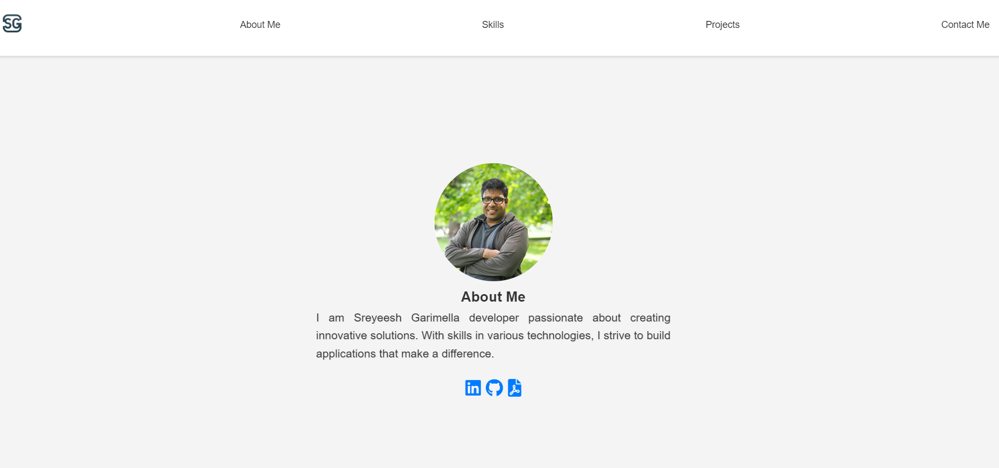

# Portfolio Website



This is a simple and clean portfolio website template that  I made. It allows me to showcase my skills, projects, and provide way for people to contact me. The website is designed to help me have a professional online presence and share my work with others.

## Technology Stack

- **HTML**: Used for structuring the content of the website.
- **CSS**: Applied for styling and responsive design.
- **JavaScript**: Implemented for interactivity and dynamic behavior.
- **Font Awesome**: Utilized for adding icons to the website.
- **GitHub**: Hosted and version-controlled the project on GitHub.
- **Formspree**: Integrated for handling the contact form submissions.
- **Responsive Design**: Ensured the website works on various screen sizes.
- **Deployment**: Hosted the website on GitHub Pages.

## Features

- About Me: A section where I can introduce myself and provide a brief overview of your skills and interests.
- Skills: Display my skills and expertise in various technologies.
- Projects: Showcases my projects with descriptions and links to GitHub or external pages.
- Contact Me: A contact form for visitors to get in touch with me.

## Getting Started


1. Clone this repository to your local machine:

   ```bash
   git clone https://github.com/your-username/your-portfolio.git
   ```
## Author

- [Sreyeesh Garimella](https://github.com/Sreyeesh)

## Feedback and Contributions

Feedback, bug reports, and contributions are welcome! If you have any suggestions or improvements, please [open an issue](https://github.com/Sreyeesh/SreyeeshGarimella/issues)

### Live Demo

https://sreyeesh.github.io/SreyeeshGarimella/